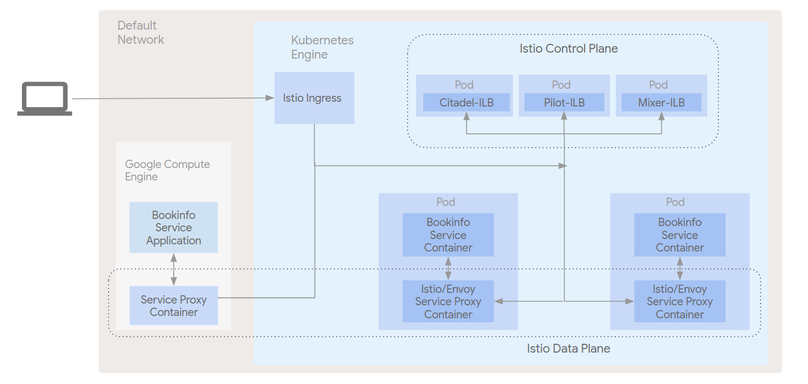

# Istio Service Mesh expansion to GCE

## Table of Contents
<!--ts-->
* [Introduction](#introduction)
* [Architecture](#architecture)
   * [Istio Overview](#istio-overview)
      * [Istio Control Plane](#istio-control-plane)
      * [Istio Data Plane](#istio-data-plane)
   * [BookInfo Sample Application](#bookinfo-sample-application)
   * [Architecture](#architecture-1)
* [Prerequisites](#prerequisites)
   * [Tools](#tools)
* [Deployment](#deployment)
* [Validation](#validation)
* [Tear Down](#tear-down)
* [Relevant Material](#relevant-material)
<!--te-->

## Introduction

In this demo, we leverage [Google Kubernetes
Engine](https://cloud.google.com/kubernetes-engine/) (Kubernetes Engine) and
[Google Compute Engine](https://cloud.google.com/compute/) (GCE) to learn more
about how Istio can manage services that reside in the network outside of the
Kubernetes Engine environment. This demo uses Kubernetes Engine to construct a
typical Istio infrastructure and then setup a GCE instance running a
[MySQL](https://www.mysql.com/) microservice that will be integrated into the
Istio infrastructure. We will use the sample BookInfo application and extend it
by using the MySQL microservice to house book reviewer ratings. The demo serves
as a learning tool and addresses the use case of users who want to leverage
Istio to manage other services in their
[Google Cloud Platform](https://cloud.google.com/) (GCP) environment that may
not be ready for migration to Kubernetes Engine just yet.

## Architecture

### Istio Overview

Istio has two main pieces that create the service mesh: the control plane and
the data plane.

#### Istio Control Plane

The control plane is made up of the following set of components that act
together to serve as the hub for the infrastructure's service management.

- **Mixer**: a platform-independent component responsible for enforcing access
  control and usage policies across the service mesh and collecting telemetry
  data from the Envoy proxy and other services

- **Pilot**: provides service discovery for the Envoy sidecars, traffic
  management capabilities for intelligent routing, (A/B tests, canary
  deployments, etc.), and resiliency (timeouts, retries, circuit breakers,
  etc.)

- **Citadel**: provides strong service-to-service and end-user authentication
  using mutual TLS, with built-in identity and credential management.

#### Istio Data Plane

The data plane is comprised of all the individual service proxies that are
distributed throughout the infrastructure. Istio uses
[Envoy](https://www.envoyproxy.io/) with some Istio-specific extensions as its
service proxy. It mediates all inbound and outbound traffic for all services in
the service mesh. Istio leverages Envoy’s many built-in features such as
dynamic service discovery, load balancing, TLS termination, HTTP/2 & gRPC
proxying, circuit breakers, health checks, staged roll-outs with
percentage-based traffic splits, fault injection, and rich metrics.

### BookInfo Sample Application

The sample [BookInfo](https://istio.io/docs/guides/bookinfo.html)
application displays information about a book, similar to a single catalog entry
of an online book store. Displayed on the page is a description of the book,
book details (ISBN, number of pages, and so on), and a few book reviews.

The BookInfo application is broken into four separate microservices and calls on
various language environments for its implementation:

- **productpage**. The productpage microservice calls the details and reviews
  microservices to populate the page.
- **details**. The details microservice contains book information.
- **reviews**. The reviews microservice contains book reviews. It also calls the
  ratings microservice.
- **ratings**. The ratings microservice contains book ranking information that
  accompanies a book review.

There are 3 versions of the reviews microservice:

- **Version v1** doesn’t call the ratings service.
- **Version v2** calls the ratings service, and displays each rating as 1 to 5
  black stars.
- **Version v3** calls the ratings service, and displays each rating as 1 to 5
  red stars.


To learn more about Istio, please refer to the
[project's documentation](https://istio.io/docs/).

### Architecture

The pods and services that make up the Istio control plane is the first part of
the architecture that gets installed into Kubernetes Engine, at the time we
install the BookInfo application we simultaneously install an istio service
proxy alongside each micro service in the application. At this point we have
our two tiers that make up the Istio architecture, our Control Plane and our
Data Plane, and we have microservices to manage.

In the diagram, note
* all input and output from any BookInfo microservice goes through the service
  proxy
* each service proxy communicates with each other and the Control plane to
  implement the features of the service mesh, circuit breaking, discovery, etc.
* the Mixer component of the Control Plane is the conduit for the telemetry
  add-ons to get metrics from the service mesh
* the Istio ingress component to provide external access to the mesh
* the environment is setup in the Kubernetes Engine default network




## Prerequisites

### Tools

In order to use the code in this demo you will need to have have access to a
bash shell with the following tools installed:

* A [GCP project](https://cloud.google.com/) with billing enabled
* [Google Cloud SDK (v204.0.0 or later)](https://cloud.google.com/sdk/downloads)\
* [kubectl (v1.10.0 or later)](https://kubernetes.io/docs/tasks/tools/install-kubectl/)
* git
* A bash-compatible shell

## Deployment
To deploy this demo, clone the repository and change directory to the
`gke-istio-gce-demo` directory. Note that this directory is considered the working
directory and all of the following commands should be run in it.
Additionally, clone the `gke-istio-shared` repository as it contains necessary
files for this demo to run correctly.

In the `gke-istio-gce-demo` directory:

1. Copy the `properties` file to `properties.env` and set the following
   variables in the `properties.env` file:
       * PROJECT - the name of the project you want to use
       * REGION - the region in which to locate for all the infrastructure
       * ZONE - the zone in which to locate all the infrastructure
1. Run the following command

```console
./setup.sh
```

The script should deploy all of the necessary infrastructure and install Istio.

The script will end with a line like this, though the IP address will be different:
```
Update istio service proxy environment file
104.196.243.210/productpage
```

## Validation

To validate that everything is working correctly, first open your browser to
the URL provided at the end of the installation script. Once the ratings
service is running correctly, run

```console
./validate.sh <STARS>
```

and substitute <STARS> for the number of stars to return. The value of <STARS>
must be an integer between 1 and 5.

If you refresh the page in your browser, the first rating should return the
number of stars you entered. This shows that the rating has made it to the ratings
service. While the database micro service isn't contained in the GKE cluster, it
works seemlessly via the Istio data plane.

## Tear Down

To tear down the resources created by this demo, run

```console
./teardown.sh
```

NOTE - Keep an eye on quotas, the tear down script deletes resources it is
aware of but cannot account for all the resources generated during the setup of
the infrastructure

## Relevant Material

This demo was created with help from the following links

- https://cloud.google.com/kubernetes-engine/docs/tutorials/istio-on-gke
- https://cloud.google.com/compute/docs/tutorials/istio-on-compute-engine
- https://istio.io/docs/guides/bookinfo.html
- https://istio.io/docs/setup/kubernetes/mesh-expansion.html
- https://istio.io/docs/guides/integrating-vms.html


**This is not an officially supported Google product**
